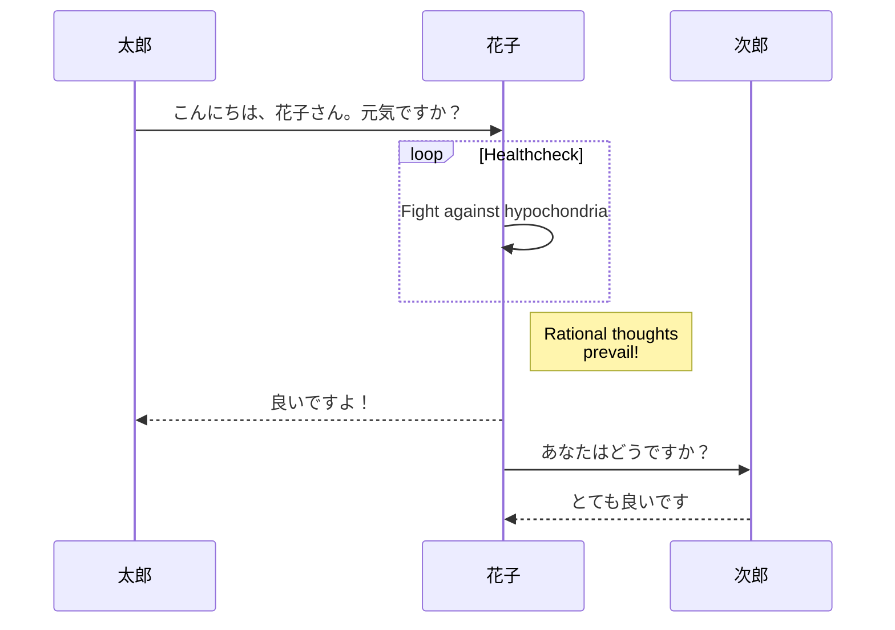
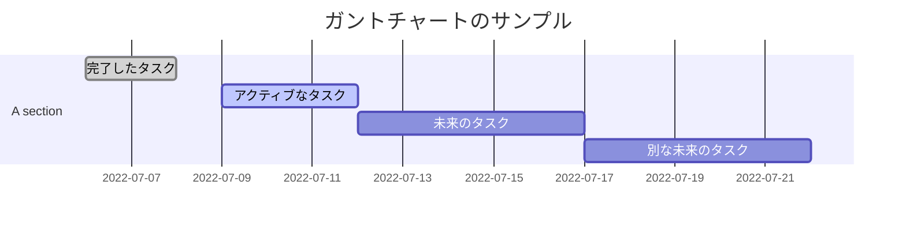
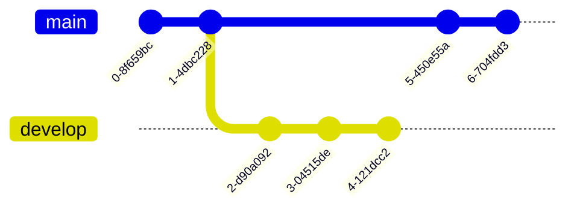
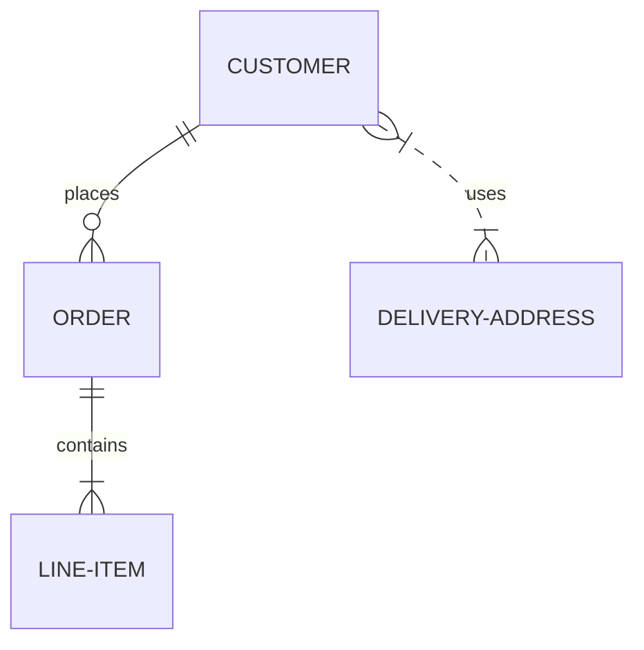
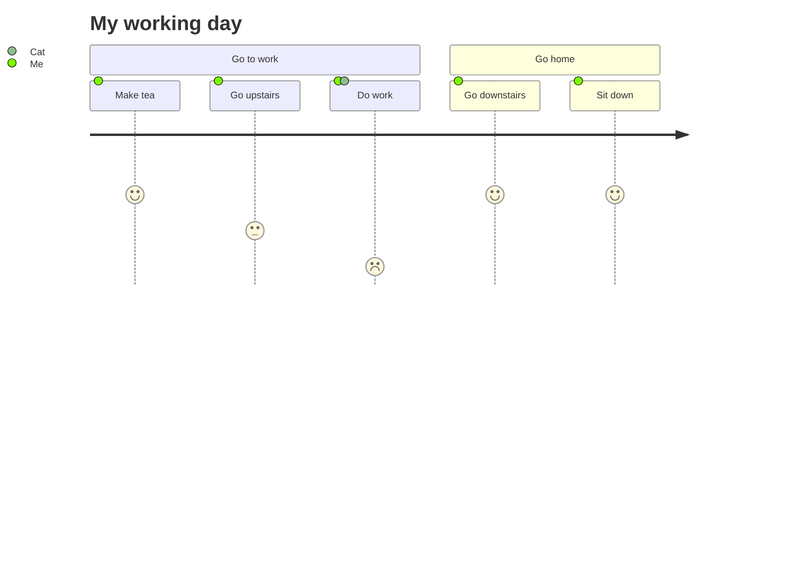
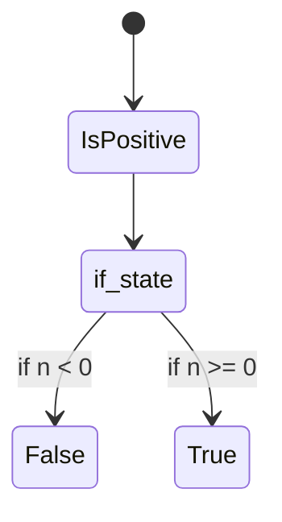
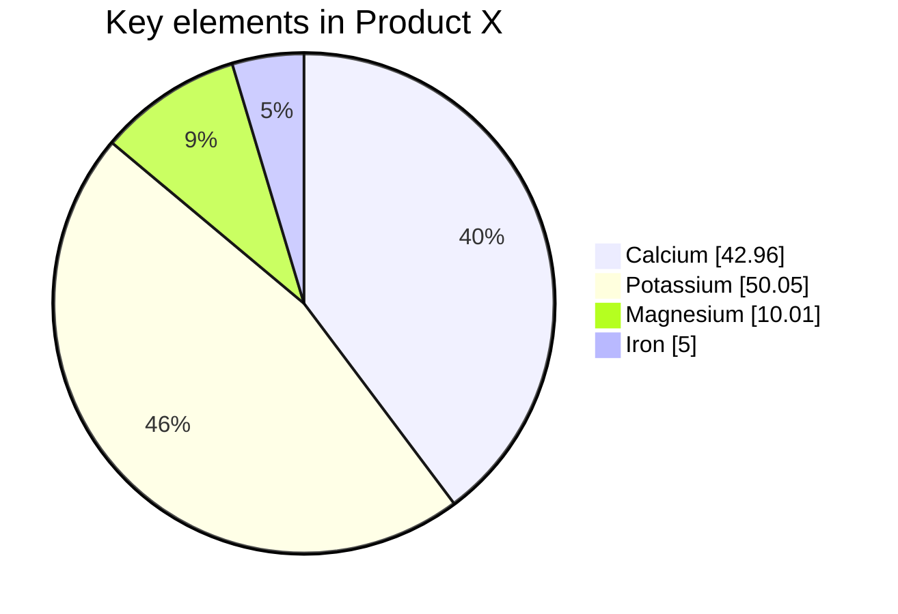
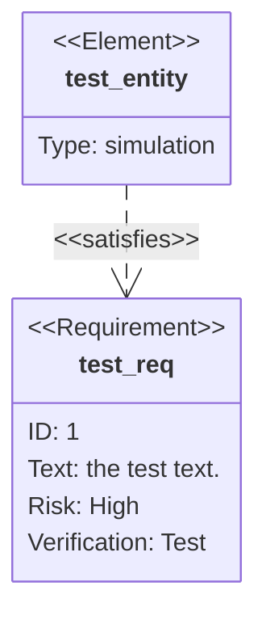
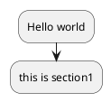

# マスタートップ

```mermaid
graph TD;
    A-->B;
    A-->C;
    B-->D;
    C-->D;
```

```mermaid
sequenceDiagram
    participant 太郎
    participant 花子
    太郎->>花子: こんにちは、花子さん。元気ですか？
    loop Healthcheck
        花子->>花子: Fight against hypochondria
    end
    Note right of 花子: Rational thoughts <br/>prevail!
    花子-->>太郎: 良いですよ！
    花子->>次郎: あなたはどうですか？
    次郎-->>花子: とても良いです
```

```mermaid
gantt
dateFormat  YYYY-MM-DD
title ガントチャートのサンプル
excludes weekdays 2014-01-10

section A section
完了したタスク            :done,    des1, 2022-07-06,2022-07-08
アクティブなタスク        :active,  des2, 2022-07-09, 3d
未来のタスク              :         des3, after des2, 5d
別な未来のタスク          :         des4, after des3, 5d
```

```mermaid
gitGraph
    commit
    commit
    branch develop
    commit
    commit
    commit
    checkout main
    commit
    commit
```

```mermaid
erDiagram
    CUSTOMER ||--o{ ORDER : places
    ORDER ||--|{ LINE-ITEM : contains
    CUSTOMER }|..|{ DELIVERY-ADDRESS : uses
```

```mermaid
journey
    title My working day
    section Go to work
      Make tea: 5: Me
      Go upstairs: 3: Me
      Do work: 1: Me, Cat
    section Go home
      Go downstairs: 5: Me
      Sit down: 5: Me
```

```mermaid
stateDiagram
    [*] --> IsPositive
    IsPositive --> if_state
    if_state --> False: if n < 0
    if_state --> True : if n >= 0
```

```mermaid
pie showData
    title Key elements in Product X
    "Calcium" : 42.96
    "Potassium" : 50.05
    "Magnesium" : 10.01
    "Iron" :  5
```

```mermaid
requirementDiagram
    requirement test_req {
    id: 1
    text: the test text.
    risk: high
    verifymethod: test
    }

    element test_entity {
    type: simulation
    }

    test_entity - satisfies -> test_req
```

```plantuml
@startuml
:Hello world;
:this is section1;
@enduml
```
