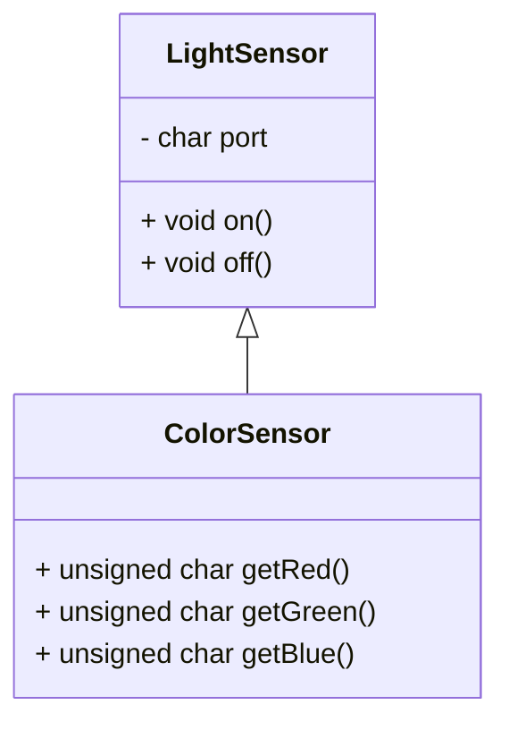

# なんかの機能

```mermaid
classDiagram-v2
    LightSensor <|-- ColorSensor
    class LightSensor {
        - char port
        + void on()
        + void off()
    }
    class ColorSensor {
        + unsigned char getRed()
        + unsigned char getGreen()
        + unsigned char getBlue()
    }
```
